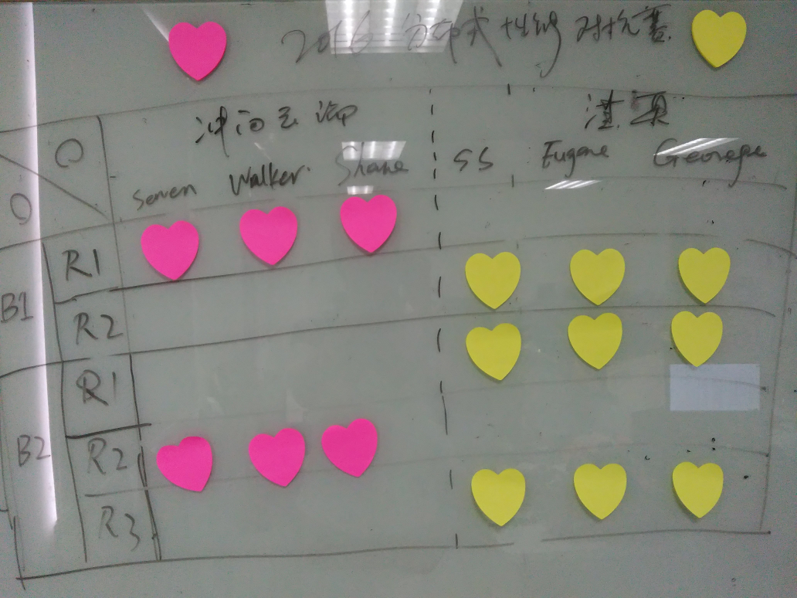
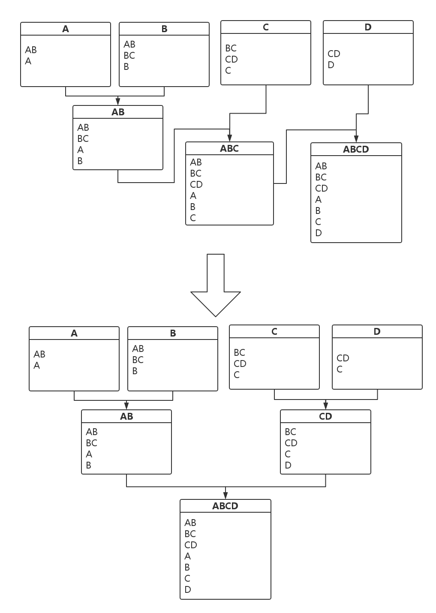
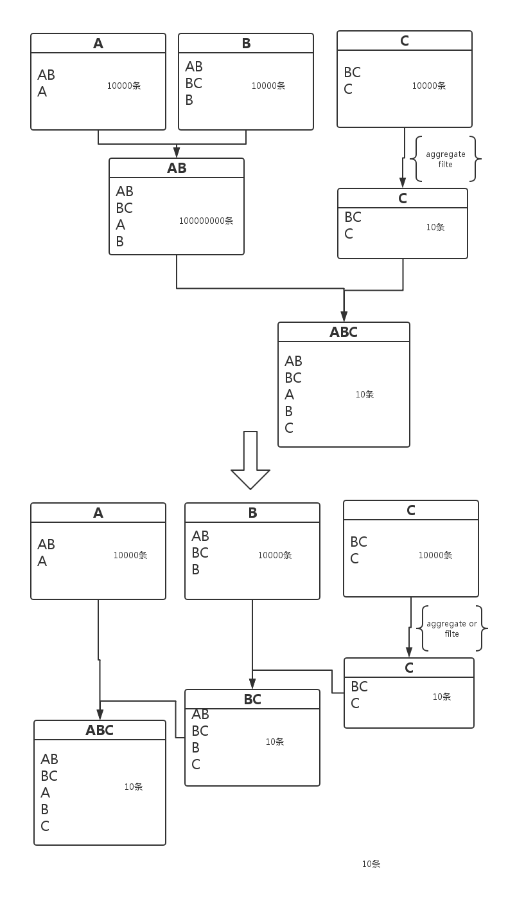

#Wars of DBS#
------
**Wars of DBS**是一场于2016年8月至2016年9月之间，500.COM运维中心数据平台组进行的一次分布式数据库性能优化对抗。

>#####**目录**
>1. [事件概述](#wars-of-dbs_1-事件概述)
>2. [事件起因](#wars-of-dbs_2-事件起因)
>3. [对阵双方](#wars-of-dbs_3-对阵双方)
>*  [冲向云端阵营](#wars-of-dbs_3-对阵双方_冲向云端阵营)
>*  [淇奥阵营](#wars-of-dbs_3-对阵双方_淇奥阵营)
>4. [对阵阶段](#wars-of-dbs_4-对阵阶段)
>*  [第一阶段](#wars-of-dbs_4-对阵阶段_第一阶段-hadoop-vs-greenplum)
>*  [第二阶段](#wars-of-dbs_4-对阵阶段_第二阶段-hadoop-vs-hadoop)
>5. [对阵结果](#wars-of-dbs_5-对阵结果)
>6. [经验总结](#wars-of-dbs_6-经验总结)
>7. [个人总结](#wars-of-dbs_7-个人总结)
>8. [References](#wars-of-dbs_8-references)

#####**1-事件概述**
------
2016年8月，500.COM数据仓库计划中的新Hadoop集群所有机器全部上架。在正式将数据仓库迁移到此集群之前，数据平台组对该集群进行了一系列的性能和压力测试。
然而，相比于前一代使用GreenPlum数据库的数据仓库，该集群的处理能力和稳定性等诸多方面，并无体现出显著优势，由此，组内意见分裂为两个派系，分别支持两组集群。
为解决分歧，组内组织了一次性能对抗，组员各自选择阵营，各自对其支持的集群进行调优，并运行相同的代码，最终由各自总耗时决定胜负。
然而，由于双方胜负未分，遂加赛三场。此三场中双方阵营在相同的环境下，对Hadoop进行优化，并由此决出胜者。

#####**2-事件起因**
------
在新Hadoop集群的逐步搭建和测试过程中，当其运行主机数量为1+8时，数据平台组同时对其以及原GreenPlum数据仓库(主机数量为2+8)，在相同数据量前提下，进行了第一次对比测试。测试的结果并未如众人所预期，而是原GreenPlum数据仓库略有胜出，考虑到其已运转多年，且硬件条件落后等其他影响因素，可以认为是GreenPlum的胜出。
面对此让人大失所望的结果，组内的意见分成了两个阵营：一派认为新Hadoop没有做到最佳配置，所以没能胜出；另一派观点则是GreenPlum在效率上胜出不假，然而，还有其他方面的因素需要加以关注。
至此，双方的观点均不能让另一方完全接受，遂约定各自对其支持的集群加以调优，以决胜负。

#####**3-对阵双方**
------

######**冲向云端阵营**
组成人员为：陆文超，朱焕青，孙卫强

######**淇奥阵营**
组成人员为：杜思昌，祝林青，郭照阳

#####**4-对阵阶段**
------

######**第一阶段: Hadoop VS GreenPlum**
由冲向云端阵营负责对Hadoop进行调优，淇澳阵营负责对GreenPlum调优。分别测试行存储和列存储方式下，两种架构的性能对比。

双方集群的硬件配置如下：
<table>
    <tr><td></td>
        <td>Master CPU</td><td>Master Memory</td>
        <td>DN CPU</td><td>DN Memory</td><td>DN Hard Disk</td><td>Net Band</td><td>#Nodes</td>
    </tr>
    <tr><td>Hadoop</td>
        <td>Intel E5-2620 v3 * 4</td><td>378 GB</td>
        <td>Intel E5-2620 v3 * 4</td><td>256 GB</td><td>4 TB * 10</td><td>10Gb</td><td>1 + 8</td>
    </tr>
    <tr><td>GreenPlum</td>
        <td>Intel E5620 * 4</td><td>64 GB</td>
        <td>Intel E5-2609 * 2</td><td>64 GB</td><td>12 TB(Mix of SSD & Raid 5)</td><td>1Gb * 4</td><td>2 + 8</td>
    </tr>
</table>
此外，Hadoop集群为刚上架的新硬件，但尚未完成全面测试；GreenPlum方面机龄为3年有余，目前仍正常运作。

######**第二阶段: Hadoop VS Hadoop**

然而第一阶段对抗从开始，就没有对规则进行过完整的阐述，而Hadoop和GreenPlum的异构，导致双方对结果无法达成共识，无奈之下，遂增加第二阶段角逐。

对阵双方各维护一套Hadoop集群，保持硬件环境基本一致，双方均使用[第一阶段](#wars-of-dbs_4-对阵阶段_第一阶段-hadoop-vs-greenplum)Hadoop集群的硬件设施，规模均为1 Master + 8 Data Nodes，各自对其所属的集群进行调优。分三轮，依次对软件配置、测试代码、系统配置进行调整。最终胜负根据每一轮的结果加以判定，胜者由胜出两轮以上的阵营取得，每轮对抗有其特定的限制规则：

* 第一轮：只允许修改软件配置
* 第二轮：保持软件配置一致，只允许对目标SQL进行优化
* 第三轮：除不能更改原始数据结构，任意优化方式均可

#####**5-对阵结果**
------

<table>
    <tr><td>总耗时(秒)</td><td>冲向云端阵营</td><td>淇奥阵营</td></tr>
    <tr><td>第一阶段 第一轮</td><td>23028</td><td>17068</td></tr>
    <tr><td>第一阶段 第二轮</td><td>10593 [1]</td><td>8136 [2]</td></tr>
    <tr><td>第二阶段 第一轮</td><td>8057</td><td>7772</td></tr>
    <tr><td>第二阶段 第二轮</td><td>3118 [3]</td><td>2853 [3]</td></tr>
    <tr><td>第二阶段 第三轮</td><td>2334 [4]</td><td>1719 [4]</td></tr>
</table>

_[1] 冲向云端阵营启用列存储格式_

_[2] 淇奥阵营有对测试代码进行更改_

_[3] 部分输出结果有误，此时间为勘误后的结果_

_[4] 次轮测试中有使用并发，此时间为实际时间，非总时间_

_[*]以上所有对阵结果数据，其原始数据量级均为2TB，计时精度为秒。_

第一阶段：由于双方均使用了规则以外的手段，结果无效，计为平局。
第二阶段：第一轮淇奥阵营胜出；第二轮，双方改良后的代码均有纰漏，将有误部分的时间消耗改用上一轮的时间替代后，冲向云端阵营胜出；第三轮，考虑到记时规则为统计实际时间，而非总执行时间，双方均使用了2重并发以压缩实际时间。

最终赛果如下：

#####**6-经验总结**
------

###### Phase2-Round1 ######
- 当有小表时，尽量广播小表，使用**BroadcastHashJoin**来代替Common Join（SortMergeJoin和HashJoin）。可以设置**spark.sql.autoBroadcastJoinThreshold**大小，来调整需要广播的表。注意，广播太大的表可能比Common Join耗时长。
- 参数**spark.shuffle.partition**对Spark性能影响大。这个参数决定在做shuffle Read的时候，启动的Task数量。 在一定的数据量下，如果task数量太多，每个task处理的数据量少，造成时间的浪费；如果task数量太少，每个task处理的数据量变大，可能导致频繁GC甚至内存溢出。每个SQL，根据其业务的不同，Executor内存大小不同，其合适的partition数不同。 做法是由大到小变动partition个数，找到一个比最快稍大一点的值。*有条件的，可以从源代码出发，实现自动动态调整。*
- 在使用完全部资源的前提下，使**executor数量**尽量最小，减少shuffle的数据量。
- 在shuffle数据量大的情况下，如果GC时间太长甚至出现oom，适度提高**spark.yarn.executor.memoryOverhead**的值，能提高spark性能。
- 如果spark版本1.6以上，尽量使用动态内存管理**UnifiedMemoryManager**,尤其是在不熟悉静态内存管理**StaticMemoryManager**的情况下。本次优化中，shuffle的数据量巨大，我们调整 **spark.shuffle.memoryFraction至0.6**，**spark.storage.memoryFraction至0.2**取得最佳性能

###### Phase2-Round2 ######
- 使单线变成多线，无依赖的关系的表可以做sql操作，可以充分利用spark并行执行的优点。 eg.

- 使聚合或者过滤条件提前，能有效减少数据量。 eg.

- 利用分区条件，减小搜索范围,减小数据量。
- left join + where 条件  =》 join
- （大表1 union 大表2） join 小表 =》 （大表1 join 小表）union （大表2 join 小表）
- distinct语句 改为 group by语句
- 结对编程，注意核对数据，保障数据准确性

###### Phase2-Round3 ######
 
###### 有效措施 #######
- 多通道：无依赖关系的SQL语句，可以分布在多个context里执行。
- 算法优化：使用版本较新的snappy压缩算法，提升程度在5%左右。
- 资源利用优化：对不同的的SQL，配备合适的不同资源级别的context。

*其中，多通道并行context收益最大*
 
###### 无效措施 #######
- 数据本地化：更改复制因子为8，使每台独立机器都持有一份完整数据，但效果不明显。
- 块大小： 默认参数128M较96M和256M在测试中效果为最好。
 
###### Todo List #######
- 测试alluxio（tachyon）对业务的提升
- 使用Spark2.0 测试

#####**7-个人总结**
- 杜思昌：对Greenplum列存储和表压缩有了进一步的认识，对spark的体系和调优有了比较清晰的认识。
- 朱焕青：了解了hdfs center cache 及 其对性能的影响
- 郭照阳：了解、使用 GP分区、索引，了解、使用Spark配置参数
- 孙卫强：了解Spark的内存机制及Spark调优相关知识
- 祝林青：对Hadoop生态圈相关组件的部署、管理、维护进行了较系统的实践
- 陆文超：对Spark的新旧内存管理机制、Spark调优有了更深入的认识与实践

#####**8-References**
------
